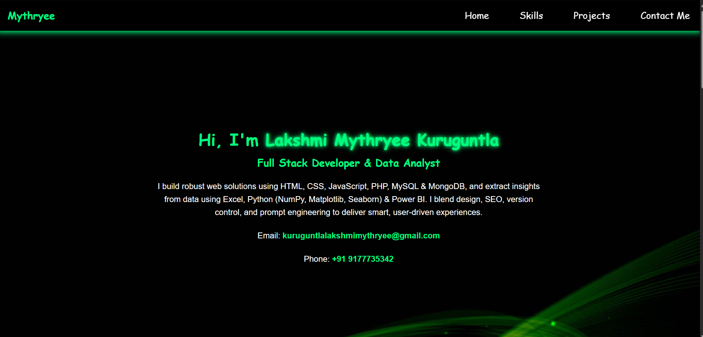
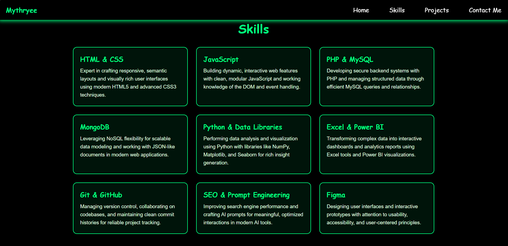
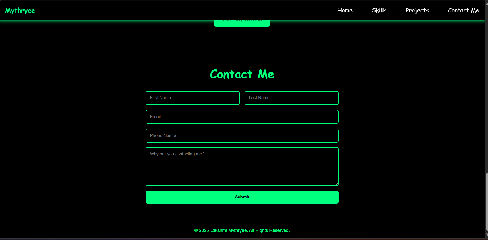
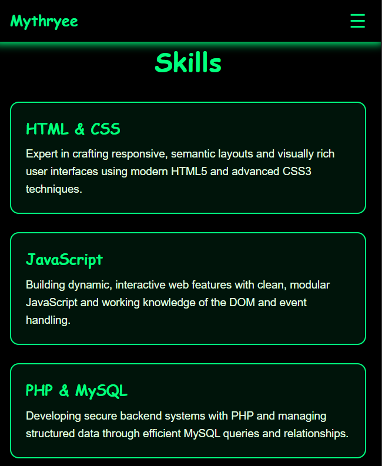
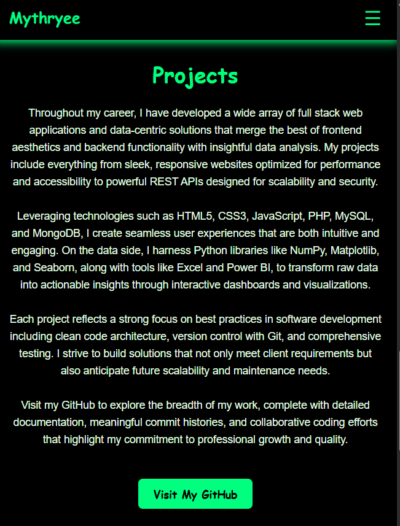
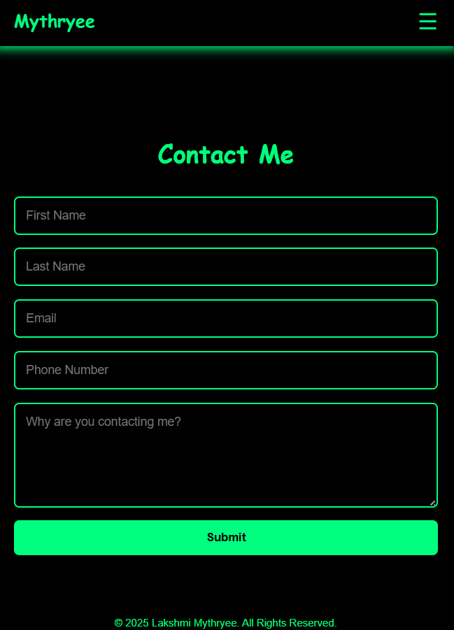

# 🌐 Portfolio Website

Welcome to my personal portfolio website! This site showcases my skills in web development and data analysis. It’s built using **HTML, CSS, JavaScript, PHP, MySQL**, and **PHPMailer**, and includes a fully functional contact form, a projects section, and a visual presentation of my technical skills.

---

## 🚀 Features

- ✅ **Responsive Design** – Mobile-friendly and accessible across devices
- ✅ **Contact Form with Validation** – PHP backend with MySQL storage and email confirmation via PHPMailer
- ✅ **Skill Grid** – Showcasing frontend, backend, and data skills
- ✅ **Project Showcase** – Highlights of full-stack and data projects
- ✅ **Git Integration** – Version control with Git and collaboration via GitHub
- ✅ **Modern SEO & Prompt Engineering** – For improved web visibility and AI prompt capabilities

---

## 📸 Screenshots

| Home Section | Skills Section | Project Section | Contact Form |
|--------------|----------------|--------------|--------------|
|  |  |  | |
|  |  |  | |

---
## 📸 Mail
|  |

---

## 🛠️ Tech Stack

| Category         | Tools / Technologies                                 |
|------------------|------------------------------------------------------|
| **Frontend**     | HTML5, CSS3, JavaScript                              |
| **Backend**      | PHP, MySQL, MongoDB                                  |
| **Data Analysis**| Python (NumPy, Matplotlib, Seaborn), Power BI, Excel |
| **Email System** | PHPMailer (SMTP with Gmail)                          |
| **Design**       | Figma                                                |
| **Version Control** | Git & GitHub                                     |
| **Other**        | SEO Optimization, Prompt Engineering                 |

---

## 🧱 Folder Structure
```portfolio-website/
│
├── Components/ # Reusable components like navbar.php
│ └── navbar.php
│
├── phpmailer/ # PHPMailer library files
│ ├── src/
│ │ ├── Exception.php
│ │ ├── PHPMailer.php
│ │ └── SMTP.php
│
├── images/ # Screenshots and images for documentation
│ ├── home.png
│ ├── skills.png
│ └── contact.png
│
├── style.css # Main CSS file
├── index.php # Main PHP file
└── README.md # This README file
```


---

## 🗄️ Database Setup

To make the contact form fully functional, you need to create a MySQL database and table to store user messages.

### 1. Create the Database

Log in to your MySQL server and run:
```
sql
CREATE DATABASE portfolio;
USE portfolio;
CREATE TABLE clients (
    id INT AUTO_INCREMENT PRIMARY KEY,
    first_name VARCHAR(50) NOT NULL,
    last_name VARCHAR(50) NOT NULL,
    email VARCHAR(100) NOT NULL,
    phone VARCHAR(15) NOT NULL,
    message TEXT NOT NULL,
    submitted_at TIMESTAMP DEFAULT CURRENT_TIMESTAMP
);

$servername = 'localhost';
$username = 'root';        // Your MySQL username
$password = '';            // Your MySQL password
$database = 'portfolio';   // Database name
```


---

### 2. Add instructions or notes for **setting SMTP credentials**

Since you’re using PHPMailer with Gmail SMTP, maybe add a small note about:

- Generating an **App Password** if 2FA is enabled on Gmail.
- Ensuring “Less secure app access” is enabled or using OAuth if you want better security.

Example snippet you can add:

```markdown
---

## 🔐 SMTP Configuration Notes

To send emails via Gmail SMTP in PHPMailer:

- Enable **2-Step Verification** on your Google account.
- Generate an **App Password** (16-character code) in Google Account Security settings.
- Use this App Password as the SMTP password in your PHP script.

This ensures secure and reliable email sending without exposing your main Gmail password. does anything look weird or it is done by ai 

